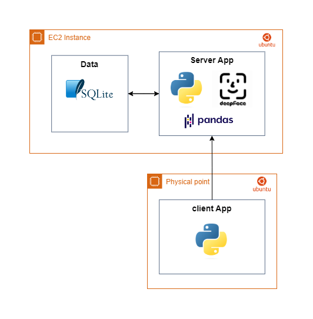

# ARKANGEL AI Challenge

This app is based on create embeddings representations of the images with FaceNet, once a new face is searched it will search for the most similar (less distant using Euclidean distance) embedding. This is based on the explanation by the autor on his [github repo](https://github.com/serengil/tensorflow-101/blob/master/python/Face-Recognition-SQL.ipynb) and an [article](https://sefiks.com/2021/02/06/deep-face-recognition-with-sql/). I used the default mode to perform the sentiment analysis provided by the library.

This solution is based on FaceNet embeddings representation provided by [Deepface](https://github.com/serengil/deepface) library with data from [LFW](http://vis-www.cs.umass.edu/lfw/) dataset under under a client-server architecture. Lastly, this was implemented on python, in Ubuntu on an aws ec2 instance.

## Usage

1. Make sure of install the depedencies form *requirements.txt*.
1. Install sqlite.
1. Depending on the enviroment some OS modules should be needed before running the app.
1. Execute *server_app.py* with the required parameters. create a tmp to store  tmp files sent by the clients if needed. First time execution will install required models, so it will take a longer time to run.
1. Once the app is up an running, you can begin to run the clients app to launch requests to the server.

## Notable files & dirs

- *data/create_db.py*:  it creates an sqlite database from an images folder with the structure {root_folder}/{person_name folder}+/{{person_name}.jpg}+, take for example the *structure found on data/test_db/*
- *data/test_img*:  some images to test the app
- *data/facialdb.db*: embeddings database from test_db
- *networkapp/app.py*: simple working app with some examples in the code and without the client-server architecture.
- *networkapp/client_app.py:* client side of the app, it sends the image to the server node.
- *networkapp/server_app.py:* server side of the client, it receives the images comming from the clients and proccesses it to give a response about the face recognition and the emotional detection. 